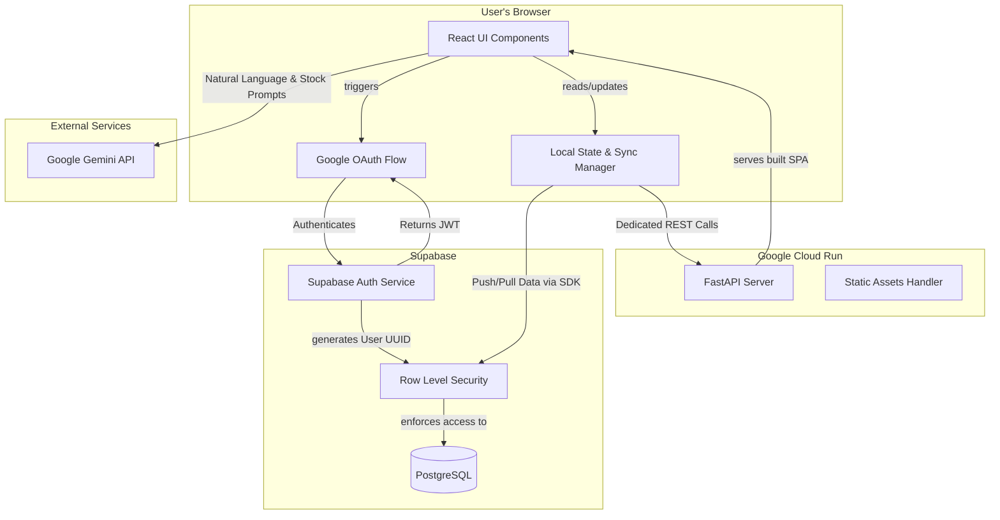

# Building FinanceFlow: A Comprehensive Personal Finance Dashboard

Welcome to the development journey of **FinanceFlow** (`cashflow`), a comprehensive, modern financial planning dashboard. The goal of this project was to create a visually appealing, highly functional web app allowing users to track monthly expenses, project investment growth, set savings goals, manage portfolios, and even receive AI-powered financial advice.

In this post, I'll walk through the app development process, the tech stack we chose, the REST API architecture, and how we integrated Supabase, Google Authentication, and testing into our deployment pipeline.

---

## 1. App Development Process

The development of FinanceFlow followed an iterative, feature-rich approach, prioritizing user experience and data security:

1. **Frontend-First Iteration:** We started by building a robust Single Page Application (SPA) using React. We built distinct, focused components for diverse financial needs: `<Expenses />`, `<NetWorth />`, `<FIRECalculator />`, and more.
2. **State & Sync:** Before introducing a database, we built a custom `usePersistedState` hook to ensure data persisted locally. Later, we added cloud synchronization to allow users to pull and push their data securely.
3. **AI Integration:** We integrated Google Gemini AI early on to provide unique features like natural language financial advice (`<AIAdvisor />`) and real-time stock price grounding.
4. **Backend Expansion:** As the app grew, we began migrating to a dedicated custom REST API to handle complex business logic securely, especially for expense management and external integrations.
5. **Containerized Deployment:** We containerized the application using Docker, manually pushing images to Google Artifact Registry and deploying them via Google Cloud Run to ensure a scalable, serverless environment.

---

## 2. System Architecture

Below is a high-level representation of how the different components of FinanceFlow communicate with one another:

---

## 3. The Tech Stack

FinanceFlow leverages a modern, decoupled tech stack designed for speed, type safety, and scalability:

### Frontend
* **React 19 & TypeScript:** For building a safe, component-driven UI.
* **Vite:** As our lightning-fast build tool and development server.
* **Tailwind CSS (via CDN):** For rapid, utility-first styling and creating rich, gradient-heavy visual aesthetics.
* **Recharts & Lucide React:** For rendering beautiful, responsive data visualizations and icons.

### Backend & Cloud
* **FastAPI (Python 3.13+):** A high-performance web framework for our custom REST API.
* **Supabase:** Our Backend-as-a-Service (BaaS) providing PostgreSQL, authentication, and cloud synchronization logic.
* **Docker & Google Cloud Run:** For container orchestration and serverless deployment.
* **Google Gemini AI SDK:** For generating holistic financial analysis and stock recommendations.

---

## 4. REST API Setup

While Supabase handles direct frontend-to-database communication for many features, we built a dedicated REST API using **FastAPI** to securely expose specific functionalities (like automated expense tracking).

* **Architecture:** The API uses decorators and dependency injection to manage routes cleanly (e.g., `/api/expenses`).
* **Validation:** We use **Pydantic** models (like `ExpenseBase` and `ExpenseCreate`) to strictly validate incoming JSON payloads, enforcing rules like `amount > 0` and restricting categories via Enums.
* **CORS & SPA Routing:** The API is configured with `CORSMiddleware` to accept cross-origin requests from our React dev server. In production, FastAPI double-duties by serving the built React static assets out of the `dist/` directory, acting as a unified web server.
* **Health Checks:** A zero-dependency `/health` route was implemented specifically to satisfy Google Cloud Run Load Balancer requirements.

---

## 5. Supabase Integration

Supabase sits at the core of our data infrastructure. It stores the centralized state of a user's financial life.

* **Schema Design:** We use normalized tables like `user_finances`, `user_expenses`, `user_income`, and `user_savings_history` (for timestamped net worth snapshots). 
* **Row Level Security (RLS):** Security is paramount in a finance app. We wrote custom SQL policies (`SUPABASE_SECURITY.sql`) enforcing strict RLS. Every row is tagged with a `user_key`, ensuring users can only read, update, or delete their own data.
* **Cloud Syncing:** The `supabaseService.ts` handles pushing complex JSON blobs and pulling them smoothly into the application's React state.

---

## 6. Google Authentication

To reduce friction and enhance security, we implemented an authentication layer with multiple entry points natively supported by Supabase Auth:

* **Google OAuth:** Users can seamlessly click "Sign in with Google." Upon successful authentication, Supabase issues a unique User ID. We use this UUID as the master `Sync ID` for the user, tying it into our RLS policies.
* **Manual Sync ID:** For users who prefer anonymity, they can generate and use a manual cryptographic key.
* **Guest Mode:** A local-only mode that bypasses the cloud entirely, storing data only in `localStorage`. 

The `<Login />` component robustly manages these three states, routing the user to the `AppMain` controller upon success.

---

## 7. Testing & Prototyping

To maintain code quality in a fast-paced environment, our testing and prototyping strategy relies on a few key pillars:

* **Interactive API Docs:** Because we use FastAPI, we get out-of-the-box Swagger UI (`/docs`). This allows us to manually test authentication tokens, Pydantic validations, and REST endpoints directly in the browser during development.
* **Jupyter Notebooks:** For deeply complex logic—like parsing raw bank statements or validating the AI agent tool bindings—we rely on Jupyter notebooks (`test_bankstatements.ipynb`). This allows data-driven prototyping before standardizing the logic into the FastAPI backend.
* **Production Build Checks:** We use `npm run build` and `npm run preview` to verify that our Vite bundler cleanly resolves all modules and Tailwind classes before packaging the static files into our Docker image container.

---

Building FinanceFlow has been an incredible exercise in merging beautiful frontend design with a strictly typed, highly secure backend. By combining React, FastAPI, Supabase, and Gemini, the app provides a snappy, personalized, and safe environment for taking control of personal finances.
