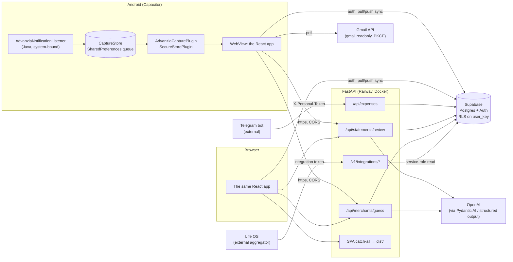
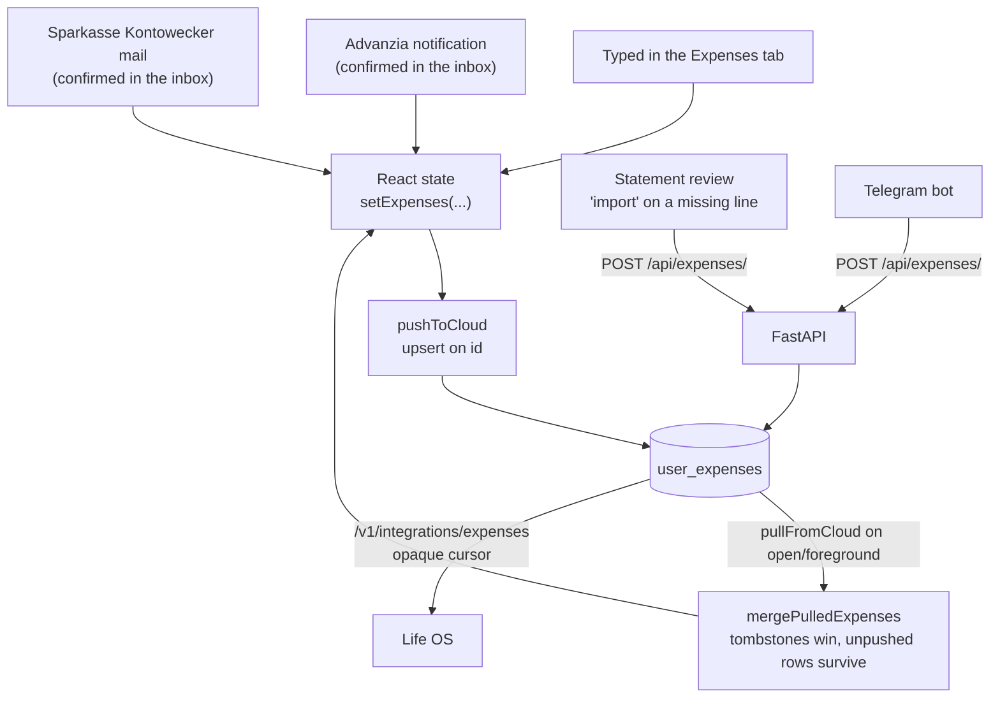
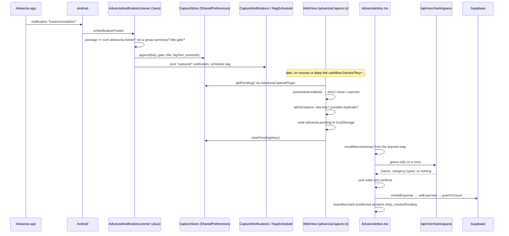

# Cashflow system architecture

How the pieces fit, and in detail the two paths that put money into the ledger
without anyone typing it: **bank statement review** (a PDF, parsed and checked
against what is already logged) and **real-time expense capture** (a card
payment that appears on the phone seconds after the terminal beeps).

Companion documents: `DATABASE.md` (tables, RLS, the three stores),
`ANDROID.md` (the native build), `lessons/05_notification_capture_and_llm_agents.md`
(why the capture code is shaped the way it is).

---

## 1. The system at a glance

One React codebase runs as a web app and, through Capacitor, as an Android app.
Both talk to Supabase directly for auth and data sync, and to a FastAPI backend
for everything that needs a server: the LLM calls, the statement pipeline, and
the integration feeds. In production the backend also serves the built web
bundle, so on the web the SPA and the API share one origin.



### Layers and where the logic lives

| Layer | Path | What it owns |
|---|---|---|
| Screens | `components/` | One file per tab. Presentation and local UI state only. |
| Pure logic | `utils/` | Parsers, money math, dedup, date handling, merge. No I/O, all unit-tested. |
| Services | `services/` | Everything that touches the outside: Supabase, the API, Gmail, native plugins. |
| App shell | `App.tsx` | Persisted state, tab routing, cloud sync, the deep-link listener. |
| API | `api/` | FastAPI routers, auth dependencies, the statement pipeline, the merchant agent. |
| Native | `android/app/src/main/java/com/aswinmanohar/cashflow/` | The notification listener, its queue, and two small Capacitor plugins. |

The boundary between `utils/` and `services/` is deliberate: anything that can
be wrong about money is a pure function with tests, and the code that talks to
a device, a mailbox, or a model is kept as thin as possible around it.

### Authentication, three ways

| Caller | Credential | Resolved by |
|---|---|---|
| The app (web or phone) | Supabase JWT as `Authorization: Bearer` | `get_current_user_id` verifies with Supabase Auth |
| The Telegram bot | `X-Personal-Token` header | Same dependency; maps to `PERSONAL_USER_ID` from the environment |
| Life OS | Per-user integration token (`X-Integration-Token` or Bearer) | `get_integration_user_key` looks up its SHA-256 hash in `integration_tokens` |

Sign-in differs by platform. The web uses Supabase's OAuth redirect. Android
cannot (Google refuses OAuth in a WebView), so it gets a native Google ID token
and exchanges it with `signInWithIdToken`. That exchange yields an identity but
no Google access token, which is why Gmail access is a separate grant
(section 4.2).

### Data ownership

The cloud is the source of truth. `localStorage` is a cache of the last pull,
with one exception: the capture inboxes (`advanzia.*`, `sparkasse.*`) live only
on the phone and have no cloud counterpart until the user confirms an item.
`DATABASE.md` covers the tables; the relevant one here is `user_expenses`,
which has a real `date` column (the calendar day the money was spent, in
Europe/Berlin), a `deleted` tombstone flag, and an `updated_at` trigger that
drives the integration change feed.

---

## 2. How an expense reaches the ledger

Every producer ends at the same place, `user_expenses`, but by different doors.



Two rules make this safe with several writers:

- **Absence is not deletion.** A pull merges rather than replaces, and a push
  upserts only the rows this client holds. Deletions travel explicitly as a
  tombstone list (`deletedExpenseIds`, persisted until the server accepts it).
  Without this the bot's rows, which the phone has not pulled yet, would be
  treated as "deleted here" and tombstoned on the next push.
- **The date is a column, not a timestamp.** `created_at` was once overloaded to
  mean "the day", which filed anything bought between midnight and 02:00 Berlin
  time onto the previous UTC day. The backend, the DB trigger
  `user_expenses_fill_date`, and the client all write `date` explicitly now.

The client also self-heals against a schema that lags a migration: the select
and upsert retry with one fewer column when PostgREST reports an unknown
column, one migration at a time, so a missing `is_subscription` column never
throws away a correct `date`.

---

## 3. Bank statement review

A PDF goes in, a report comes out, and nothing is stored. The pipeline is
`api/statement_review/pipeline.py`; the endpoint is `POST /api/statements/review`.

```mermaid
sequenceDiagram
    participant U as StatementReview.tsx
    participant E as statements.py
    participant P as parser.py
    participant R as redactor.py
    participant X as extractor.py
    participant V as reviewer.py
    participant C as crosscheck.py
    participant DB as Supabase
    participant LLM as OpenAI

    U->>E: multipart PDF, redact=true, statement_type, redact_names
    E->>E: reject > 10 MB (413)
    E->>P: extract_text(bytes)
    P-->>E: text, or PdfUnreadableError (422)
    E->>R: redact(text, names)
    R-->>E: masked text + counts per pattern
    E->>X: extract_transactions(masked text)
    X->>LLM: responses.parse(..., text_format=ExtractionResult)
    LLM-->>X: typed transactions
    X->>X: validate; retry up to 2× with the problems appended
    E->>V: build_context(user) then review_transactions
    V->>DB: income, last 90 days of expenses
    V->>LLM: flag avoidable spend (FlagList)
    LLM-->>V: typed flags ([] if never parseable)
    E->>DB: this user's live expenses
    E->>C: crosscheck(transactions, rows)
    C-->>E: missing_in_app, missing_on_statement, amount_mismatch
    E-->>U: ReviewReport (transactions, flags, crosscheck, totals, redaction counts)
    U->>E: POST /api/expenses/ for a line the user imports
```

### 3.1 Parse (`parser.py`)

`pypdf` reads the text layer of every page and joins them. Fewer than 50
characters of text means a scanned statement, which is refused with
`PDF_UNREADABLE`; there is no OCR. The whole step runs locally, and the bytes
never leave the process.

### 3.2 Redact (`redactor.py`)

This is the privacy boundary. Only text that has passed through `redact()` may
reach a model. It is deterministic, regex-based, and ordered, because the order
is what stops one pattern eating another's match:

| Order | Label | What it masks |
|---|---|---|
| 1 | `balance_line` | Any line mentioning balance / Saldo / Kontostand, whole line |
| 2 | `address` | Standalone street or postal-code lines (the account holder's address), never merchant locations inside a transaction line |
| 3 | `iban` | IBAN-shaped tokens, before the card pattern can take their digits |
| 4 | `phone` | International (`+49 …`) and local (`0…`) numbers, before the card pattern |
| 5 | `card` | 13 to 19 digit runs with optional separators |
| 6 | `partial_card` | `**** 1234` |
| 7 | `account` | Labelled account numbers (`Kontonummer:`, `A/C`) |
| 8 | `long_number` | Any bare 8+ digit run (German Konto-Nr and BLZ print with no label) |
| 9 | names | `REDACT_NAMES` from the environment plus the signed-in user's full name sent by the client |

The response carries `masked_counts`, so the UI can say what was hidden. The
lookarounds on the number patterns are what keep `01.06.2026` and `-54,30`
intact; the comments in the module record each case that shaped them.

### 3.3 Extract (`extractor.py`)

The masked text goes to OpenAI with a structured output type,
`ExtractionResult`: a list of `StatementTransaction` (ISO date, description,
positive amount, category, `direction` of debit or credit) plus optional
period bounds and the statement's own printed debit total.

The result is validated before it is trusted. Dates must be ISO, amounts must
be positive (the sign lives in `direction`, so a German `9,00-` cannot leak in
as a negative), and if the model reported a `total_debits`, the extracted
debits must reconcile with it to within 1 % or 1 EUR. A failing result is sent
back to the model with the problems listed, up to two more times. After that,
`EXTRACTION_FAILED` (502). A model that cannot be reached at all is
`LLM_UNAVAILABLE` (503), raised immediately without retrying.

### 3.4 Review (`reviewer.py`)

A second model call, grounded in the user's own numbers: monthly income from
`user_income`, and the recurring bills and per-category baseline from the last
90 days of `user_expenses` (filtered on `date`, not `created_at`, so a
back-dated entry does not pollute the baseline). It returns typed `Flag`s
(`duplicate_subscription`, `fee_or_charge`, `above_baseline`, `impulse`) with a
severity and a saving estimate. Flags naming a transaction that was not in the
input are dropped. A response that never parses into a `FlagList` after the
retries yields an empty flag list rather than sinking the review; a model that
cannot be reached at all is the same 503 as in extraction.

### 3.5 Cross-check (`crosscheck.py`)

Deliberately no model here. Statement debits are matched against the user's
live expenses in two passes:

1. **Exact amount within 3 days.** Every eligible (transaction, row) pair is
   collected, then assigned globally best-first, so the outcome does not depend
   on the order transactions appear in. Amounts are compared in integer cents.
2. **Near miss.** Among what is left, a row inside the same 3-day window whose
   name or vendor is at least 75 % similar to the description is reported as
   an `amount_mismatch` with the delta.

Whatever remains is `missing_in_app` (on the statement, not logged) or
`missing_on_statement` (logged inside the statement's period, but the bank
never saw it). The report's `coverage_pct` is the share of statement debits the
ledger already knew about.

### 3.6 Import

Tapping a `missing_in_app` line posts it to `POST /api/expenses/` with the
statement's own date as `created_at`. The backend derives `date` in Berlin time
from it, and the client appends the returned row optimistically and syncs.

---

## 4. Real-time expense capture

Two banks, two very different sources, one inbox pattern. In both cases the
principle is the same: **the machine captures, the human confirms.** Nothing
reaches `user_expenses` until it has been reviewed on the phone, and no
heuristic is allowed to delete or merge a capture on its own.

### 4.1 Advanzia: card notifications

Advanzia's app posts one notification per card transaction. Cashflow reads it
with a `NotificationListenerService`, which the system binds once the user
grants notification access. Because the system initiates the bind, the process
is started to deliver notifications even when the app is dead.



**The native side is kept stupid on purpose.** The listener applies three cheap
checks and writes the raw text; it knows nothing about amounts or merchants.
Everything that can be wrong about money is in TypeScript where `npm test`
exercises it. The two sides share nothing but the queue file, which also
decouples their lifetimes: the listener writes while the Activity does not
exist, and the WebView drains whatever accumulated the next time it opens.

**The queue is drained, not consumed.** `getPending()` is called first, the
items are written to `localStorage`, and only then is `clearPending()` called.
A crash between the two leaves items queued instead of lost; the duplicate
that would cause is caught by the handled-key set.

**Parsing fails closed.** `parseAdvanziaBody` has three tiers, checked in order:

| Tier | Trigger | Outcome |
|---|---|---|
| rejected | The sentence carries `abgelehnt`, `Gutschrift`, `storniert`, `fehlgeschlagen`, `rückerstattet` | Shown, never convertible to an expense |
| strict | Exactly `Eine Zahlung über X € der Mastercard mit der Kartenendung NNNN an MERCHANT wurde erfolgreich ausgeführt.` | Prefilled, confirmable in one tap |
| loose | Anything else | Whatever fragments were found, flagged "needs checking", must be opened before saving |

The amount parser accepts German money only (`1.234,56`) and refuses anything
else. Read with German rules, the English `1,234.56` becomes `1.23456`, an
expense wrong by a thousandfold that nothing downstream would notice. The
merchant group is greedy and the sentence suffix is anchored, because real
descriptors contain commas and are truncated mid-word (`REWE Bonn, Friedenspla`).

**Dedup is exact, resemblance is a flag.** Every notification carries a stable
key, so identity is the key and nothing else. A capture that matches a recently
handled one on amount, merchant and a five-minute window is admitted with a
`possibleDuplicateOf` badge for the user to judge. It is never dropped.

**Merchant naming is cached, then guessed, then defaulted.** The raw descriptor
is looked up in a phone-local map first. On a miss the backend's Pydantic AI
agent is asked once; its `output_type=MerchantGuess` means a category outside
the app's enum cannot come back as a success. Any failure (offline, signed out,
model down) falls back to the raw descriptor under `Other`, and capture is never
blocked. Only a user confirmation writes to the map, so an unaccepted guess
never cements itself.

**Silence is the failure mode, so it is instrumented.** A notification that
quotes a euro amount but fails the title gate is queued as `suspicious` and
raises a capture-health warning, since that is what Advanzia renaming the
title would look like from inside the app. The inbox shows "last captured"
time, whether listener access is still granted, and whether the app's own
notifications are enabled. A nag fires while unconfirmed items sit in the queue.

### 4.2 Sparkasse: Kontowecker emails

Sparkasse has no notification to read, but its Kontowecker service emails a
list of booked transactions. The app polls Gmail for those mails.

```mermaid
sequenceDiagram
    participant Inbox as SparkasseInbox.tsx
    participant Cap as sparkasseCapture.ts
    participant Auth as gmailAuth.ts
    participant Sec as SecureStorePlugin (EncryptedSharedPreferences)
    participant G as Gmail API
    participant P as sparkasseEmail.ts

    Inbox->>Cap: pollSparkasse() on mount / foreground
    Cap->>Auth: gmailFetch(list, from:noreply@kontowecker.de after:watermark-3d)
    Auth->>Sec: refresh token
    Auth->>G: exchange for access token (single-flight)
    Auth->>G: GET messages
    loop each message not in the seen set
        Cap->>G: GET message?format=full
        Cap->>Cap: decode MIME (base64url, quoted-printable, RFC 2047 subject)
        Cap->>P: parseKontoweckerEmail(sender, subject, body)
        P-->>Cap: lines: clean | flagged | incoming | settlement, or null
        Cap->>Cap: admitCapture per line (key gmail:id#index)
    end
    Cap->>Cap: write pending; only then advance seen set and watermark
    Inbox->>Inbox: user confirms a clean or flagged line → onAddExpense
```

**Authorization is its own grant.** App sign-in yields no Google token, so
Gmail access is a separate PKCE flow against an Android OAuth client with the
`gmail.readonly` scope. The refresh token is stored in
`EncryptedSharedPreferences` through the `SecureStore` plugin, never in
`localStorage`; the access token lives in memory only.

**Idempotency has to be earned.** The Advanzia queue is destructive, so a
capture can only ever be offered once. Gmail hands back the same mailbox on
every poll, so this module keeps two guards: a watermark on `internalDate`,
queried with three days of deliberate overlap because mail arrives late and out
of order, and a seen-message-id set covering everything inside that overlap.
Both advance only after the pending inbox has been written successfully; a
failed write must not mark transactions as handled while nothing holds them.

**A list parses, so a list can partially fail.** The parser reads every
`label: signed amount EUR` line below the `verbucht:` header and classifies it:

| Kind | Rule | Addable? |
|---|---|---|
| `clean` | Negative amount, ordinary counterparty | Yes |
| `incoming` | Positive or unsigned amount (money arriving, or ambiguous) | No |
| `settlement` | Counterparty mentions Advanzia (the card's monthly direct debit, already captured line by line) | No |
| `flagged` | Would be clean, but the subject's promised count disagrees with the lines found | Only after opening |

`Neuer Saldo` is shaped exactly like a transaction and is excluded by label,
never by position; read as a line it would invent a balance-sized expense on
every mail. The subject line ("3 neue Umsätze") is the only independent
witness to how many transactions the mail carries, so a mismatch demotes every
clean line to flagged rather than silently losing one. A mail that quotes a
euro amount but parses to nothing raises the same wording-changed alarm as the
Advanzia path.

### 4.3 What the two paths share

| Concern | Both paths |
|---|---|
| Pending inbox | `localStorage`, phone-local, never synced until confirmed |
| Identity | A stable key: the notification key, or `gmail:<id>#<line>` |
| Admission | `admitCapture` in `utils/advanziaQueue.ts`: novel key admits, resemblance only flags |
| Handled set | Confirmed and dismissed keys, so nothing returns after a decision |
| Money parsing | `parseGermanAmount`, the single 1000× guard, imported rather than re-implemented |
| Liveness | Last-captured, last-polled, last-suspicious, last-poll-failed timestamps on the card |
| Confirmation | `onAddExpense` → React state → `pushToCloud`, the same door as a typed expense |

---

## 5. Integration feeds

`/v1/integrations/{expenses,savings-history,income}` are read-only,
service-to-service endpoints for aggregators such as Life OS. They read through
a service-role Supabase client (so RLS does not apply) but scope every query to
the token owner's `user_key`. A missing or non-service-role key disables them
loudly at import rather than silently returning nothing.

The expenses feed supports incremental sync with an opaque cursor that encodes
`updated_at|id`. The composite matters: a bulk push stamps one timestamp on
every row, and a timestamp-only cursor would skip the ties left on the next
page. Soft-deleted rows appear as tombstones so a consumer learns about
deletions instead of holding a row forever. Recurring expenses are one row of
state with a frequency and an anchor date; consumers expand occurrences
themselves.

---

## 6. Observability

`api/observability.py` configures Logfire once. Without `LOGFIRE_TOKEN` it is a
no-op, and FastAPI instrumentation is wrapped so a missing optional extra costs
the spans, not the service. Every merchant guess becomes a trace carrying the
descriptor in, the name and category out, tokens and latency, which is what
makes a wrong category months later diagnosable. Evals for the merchant agent
live in `evals/` and include tests of the evaluators themselves, asserting that
a deliberately lazy model scores strictly worse than a decent one.

---

## 7. Build and deployment

- **Web.** Vite builds `dist/`. In development the Vite server proxies `/api`
  to FastAPI on port 8000 (`just start` runs both).
- **Android.** `npm run android:sync` builds the bundle and copies it into the
  Capacitor project. The WebView serves it from `https://localhost`, so `/api`
  calls are cross-origin and go to the Railway host (`services/apiBase.ts`),
  which is why that origin is in the backend's CORS list.
- **Backend.** A multi-stage Dockerfile builds the frontend in Node, installs
  Python dependencies from `uv.lock`, copies `dist/` in, and runs Gunicorn with
  a Uvicorn worker. FastAPI serves `/api/*` and `/v1/*`, `/health`, and falls
  through to the SPA for everything else. The catch-all resolves the requested
  file and refuses anything that escapes `dist/`.
- **CI.** GitHub Actions runs the backend suite, the typecheck and the frontend
  suite on every PR into `main`; a green push to `main` deploys to Railway.
