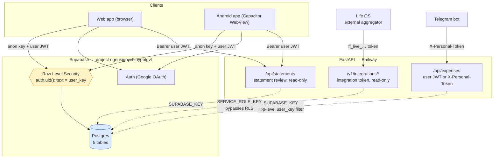
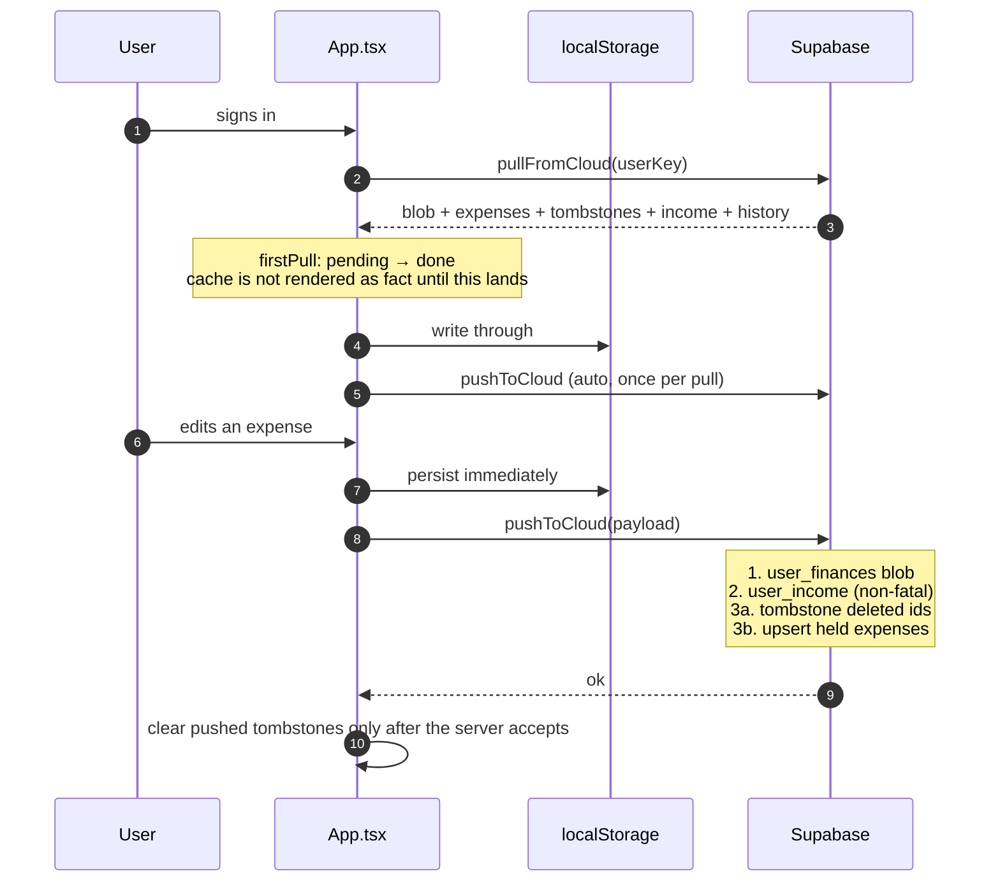

# Database architecture

How Cashflow stores data: what lives in Postgres, what lives on the device, who
is allowed to read it, and how the two halves reconcile.

> **On the accuracy of what follows.** There is no canonical DDL in this repo for
> the four original tables — they were created by hand in the Supabase SQL
> editor. Column names below are taken from the code that reads and writes them
> (`services/supabaseService.ts`, `api/routers/*.py`) and are exact. Column
> **types** are inferred from usage and from the `ALTER TABLE` statements in
> `SUPABASE_SECURITY.sql`; treat them as the intent, and confirm against the
> dashboard before relying on one. Where the repo cannot answer a question, this
> document says so rather than guessing.

## The three stores

Data lives in three places, and they are not peers:

| Store | Holds | Authority |
|---|---|---|
| **Supabase Postgres** | The five tables below | Source of truth |
| **Browser `localStorage`** | A cache of the last pull, plus the capture queues | Cache, except for the capture queues |
| **Android `EncryptedSharedPreferences`** | The Gmail OAuth refresh token, only | Sole copy |

`App.tsx:127` states the rule plainly: the cloud is the source of truth, and
`localStorage` is only a cache of the last pull. The app renders `firstPull ===
'pending'` rather than rendering the cache as fact — the failure that taught this
was "cleared cache" reading as "everything gone".

The capture queues (`advanzia.*`, `sparkasse.*`) are the exception. They hold
transactions captured from notifications and Gmail that the user has not yet
confirmed, and they have **no cloud counterpart at all**. A pending capture that
is lost is lost.

---

## Logical schema (UML class diagram)

```mermaid
classDiagram
    direction TB

    class auth_users {
        <<Supabase Auth>>
        uuid id PK
        text email
        jsonb raw_user_meta_data
    }

    class user_finances {
        <<table>>
        uuid id PK
        text user_key
        jsonb data
        timestamptz updated_at
    }

    class user_expenses {
        <<table>>
        uuid id UNIQUE
        text user_key
        text name
        numeric amount
        text category
        text vendor
        bool is_recurring
        text recurring_frequency
        bool is_subscription
        bool is_essential
        timestamptz created_at
        timestamptz updated_at
        bool deleted
    }

    class user_income {
        <<table>>
        uuid id PK
        text user_key
        numeric salary_me
        numeric salary_partner
        timestamptz updated_at
    }

    class user_savings_history {
        <<table>>
        uuid id PK
        text user_key
        timestamptz created_at
        numeric total_assets
        numeric total_liabilities
        numeric net_worth
        numeric savings_amount
        numeric investment_amount
        numeric gold_amount
        numeric stock_amount
    }

    class integration_tokens {
        <<table>>
        uuid id PK
        text user_key
        text token_name
        text token_hash UNIQUE
        timestamptz created_at
    }

    class FinanceBlob {
        <<jsonb, user_finances.data>>
        IncomeState income
        InvestmentState investment
        SavingsGoal goal
        NetWorthState netWorthData
        FIREState fire
        EmergencyFundState emergencyFund
        Loan[] loans
        PortfolioAsset[] portfolio
        Stock[] stocks
    }

    auth_users "1" <.. "0..*" user_finances : user_key = id::text
    auth_users "1" <.. "0..*" user_expenses : user_key = id::text
    auth_users "1" <.. "0..*" user_income : user_key = id::text
    auth_users "1" <.. "0..*" user_savings_history : user_key = id::text
    auth_users "1" <.. "0..*" integration_tokens : user_key = id::text
    user_finances *-- FinanceBlob : embeds
```

Dashed dependencies, not solid associations, are deliberate: **`user_key` is a
`text` column with no foreign key to `auth.users`.** Nothing at the database
level stops a row from naming a user that does not exist, and deleting a user
leaves their rows behind. The link is enforced only by RLS at write time.

### Table notes

**`user_finances`** — one row per user, holding everything that is not an
expense as a single JSON blob. `pushToCloud` (`services/supabaseService.ts:94`)
does a select-then-insert-or-update rather than an upsert, so a user with two
rows would have one of them silently ignored. Nothing enforces uniqueness on
`user_key`; a `UNIQUE` constraint would be the correct guard.

**`user_expenses`** — the only relational table, and the only one with a change
feed. Three properties matter:

- **There is no `date` column.** `created_at` doubles as the expense date
  (`services/supabaseService.ts:249`). A row's creation time and the day the
  money was spent are the same field.
- **Deletes are soft.** `deleted = true` plus an `updated_at` bump, never a row
  removal, so the change feed can tell external consumers that an expense went
  away (`api/routers/expenses.py:98-104`). A hard delete would leave Life OS
  holding it forever.
- **`id` is `UNIQUE`, and possibly not the primary key.** It was added by
  `ALTER TABLE ... ADD COLUMN IF NOT EXISTS id uuid DEFAULT gen_random_uuid()
  UNIQUE` (`SUPABASE_SECURITY.sql:50`), against a table that predates it. The
  client's `.upsert(records, { onConflict: 'id' })` needs exactly that unique
  constraint, so it works either way — but the repo cannot tell you whether the
  table has a primary key at all.

**`user_income`** — dual-written. The authoritative copy is inside
`user_finances.data.income`; this table is a convenience for the integration
feed, and its write failure is deliberately swallowed
(`services/supabaseService.ts:138-147`). If that stops being true, that catch
must start throwing.

**`user_savings_history`** — append-only time series of net-worth snapshots.
Insert and delete only; nothing updates a row.

**`integration_tokens`** — stores a SHA-256 hex digest, never the token. The raw
`ff_live_…` string is shown once at generation and never persisted, so a leaked
row cannot be replayed.

### Schema-change history

There is no migration tool in this project. Schema changes are SQL files a human
runs in the Supabase SQL editor, and they live in three places:

| File | Contains |
|---|---|
| `SUPABASE_SECURITY.sql` | All RLS enablement and policies; the V2 `ALTER`s on `user_expenses`; the `updated_at` trigger; `CREATE TABLE integration_tokens` |
| `supabase/migrations/20260714_add_is_essential.sql` | `is_essential` |
| `migrations/2026-07-31-user-expenses-is-essential.sql` | `is_essential` again — the same change, rewritten after it turned out never to have been run in production |
| `supabase/migrations/20260824_user_expenses_date.sql` | `date` — a real transaction date, replacing the overloaded `created_at` |
| `supabase/migrations/20260825_user_expenses_is_subscription.sql` | `is_subscription` — nullable, where NULL means "nobody has said" and the client falls back to inference |

Those last two are the same `ALTER`, in two directories, because the flag shipped
in the app before the column existed and expense sync failed in both directions
with `42703: column user_expenses.is_essential does not exist`. On the web,
`localStorage` masked it completely. **Two migration directories is one too
many**; consolidating on `supabase/migrations/` would remove the ambiguity about
where the next one goes.

---

## Access paths (deployment view)



Solid arrows pass through RLS. Dashed arrows do not, or may not — and that
distinction is the most important thing on this diagram.

**The client path is the only one RLS actually protects.** `supabase-js` is
created with the anon key (`services/supabaseService.ts:18`) and attaches the
signed-in user's JWT, so `auth.uid()` is populated and every policy applies.

**The backend path is scoped by application code, not by RLS.**
`get_current_user_id` (`api/dependencies.py:71`) verifies the caller's JWT and
returns their id — but the subsequent queries run through
`get_supabase_client()`, a client built from `SUPABASE_KEY`, *not* from the
caller's token. Every one of those queries therefore carries `.eq("user_key",
user_id)` as its only scoping. Whether RLS is even consulted depends on what
`SUPABASE_KEY` holds in the deployment, which the repo does not record:

- if it is the **service-role** key, RLS is bypassed and the `.eq()` filter is
  the entire access control;
- if it is the **anon** key, there is no `auth.uid()`, every policy evaluates
  false, and these endpoints would return nothing at all.

The endpoints are in use, which points at the first. Worth confirming in the
Railway variables and writing down.

**The integration feed bypasses RLS by design.** `get_service_supabase_client()`
is explicitly the service-role client (`api/dependencies.py:47`), because it
must read a user's rows without that user being present. Its authorization is
the token-hash lookup, and its scoping is `.eq("user_key", user_key)` with the
`user_key` taken from the token row — never from the request.

### Identity

`user_key` is the Supabase user id and nothing else. It used to be a "Sync ID"
text box the user typed, which was not access control at all: anyone holding the
string got the data, and RLS could not help because that path had no
`auth.uid()` (`App.tsx:88-91`). Sign-in is Google OAuth — `signInWithOAuth` on
web, `signInWithIdToken` on Android with the native client.

---

## Row Level Security

> **Found off on 2026-09-07.** A probe with the public anon key read every
> user's `user_expenses` and `user_finances` rows and inserted one. The
> policies in `SUPABASE_SECURITY.sql` were never in force on the project, and
> `integration_tokens` did not exist. `supabase/migrations/20260907_enforce_rls.sql`
> is the fix: idempotent, enables RLS on all five tables, and adds the UPDATE
> policy on `user_expenses` the client always needed. It has to be run in the
> SQL editor, and the backend must be on the service-role key first (see the
> access diagram above and the warning `api/dependencies.py` prints).

The policy set once that migration is applied:

| Table | SELECT | INSERT | UPDATE | DELETE |
|---|:--:|:--:|:--:|:--:|
| `user_finances` | ✅ | ✅ | ✅ | — |
| `user_income` | ✅ | ✅ | ✅ | — |
| `user_expenses` | ✅ | ✅ | ✅ | ✅ |
| `user_savings_history` | ✅ | ✅ | — | ✅ |
| `integration_tokens` | ✅ | ✅ | — | ✅ |

All of them use the same predicate: `(select auth.uid())::text = user_key`,
with `WITH CHECK` on every INSERT and UPDATE so a row cannot be written under
someone else's key.

### Four things worth checking in the dashboard

**1. `user_expenses` had no UPDATE policy in `SUPABASE_SECURITY.sql`, and the client updates
it constantly.** (Fixed in the 2026-09-07 migration; kept here for the reasoning.) Soft-delete tombstoning (`.update({ deleted: true })`,
`services/supabaseService.ts:160`) and the update half of
`.upsert(..., { onConflict: 'id' })` are both UPDATEs from the anon-key client.
Under RLS with no UPDATE policy, those match zero rows and report no error — a
silent no-op, which is exactly how a deletion would appear to succeed locally
and never reach the cloud. Either a policy was added in Studio and never
committed here, or this is a live bug. It is worth a two-minute check.

**2. The UPDATE policies have no `WITH CHECK`.** `user_finances` and
`user_income` restrict which rows you may update via `USING`, but nothing
constrains the resulting row, so a user can rewrite `user_key` to another user's
id and hand their row away. Both policies want `WITH CHECK (auth.uid()::text =
user_key)` alongside the `USING`.

**3. No policy names a role.** Adding `TO authenticated` scopes them properly
and, if anonymous sign-ins are ever enabled, keeps anonymous users out.

**4. `auth.uid()` is called per row.** Wrapping it as `(select auth.uid())` lets
Postgres evaluate it once per statement instead of once per row — the standard
Supabase RLS performance fix, and free to apply.

None of these are urgent for a two-person household app, and none should be
changed without running against the real database. They are recorded here so the
next person does not have to re-derive them.

---

## The sync protocol



Three rules hold this together, each one the scar of a specific failure:

**Deletions are carried explicitly, never inferred.** `deletedExpenseIds` is a
persisted list. Absence from the client's `expenses` array is *not* proof of
deletion, because the Telegram bot and any second device write rows this client
has not pulled yet. The earlier set-difference approach tombstoned exactly those
rows and propagated the delete onward to Life OS
(`services/supabaseService.ts:150-157`).

**A pending deletion beats a pulled row.** A pull can restore a row whose
tombstone has not been pushed yet — deleted while offline. Upserting it would
write `deleted: false` and resurrect the expense, so anything with a pending
deletion is dropped from the upsert (`services/supabaseService.ts:176-180`).

**A failed read must never look like an empty table.** `pullFromCloud` throws on
an expenses read error rather than returning `[]`, because `[]` would let the
next push write an empty list over real data
(`services/supabaseService.ts:238-241`). The tombstone read is allowed to fail
quietly: the merge then keeps more rows than it should, which is the safe
direction.

Ordering is `updated_at`, maintained by the `update_updated_at_column()` trigger
on `user_expenses`, and indexed by `idx_user_expenses_user_updated (user_key,
updated_at)` — the only non-constraint index the repo defines.

### The change feed cursor

`/v1/integrations/expenses` pages with an opaque base64url cursor that encodes
`"<updated_at>|<id>"` — composite, not just the timestamp, because
`pushToCloud` stamps one identical `now` across every record it writes. A plain
`gt(timestamp)` resume would skip every tied row left on the next page
(`api/routers/integrations.py:53-60`). `id` remains the dedup key, so re-pulling
the boundary row is idempotent, and `next_cursor` goes null on a short page so
steady-state polling stops instead of re-fetching forever.

---

## Device-local storage

### `localStorage` — the app-state cache

Written by `usePersistedState` (`App.tsx:63`), one key per slice:

`expenses`, `income`, `investment`, `goal`, `networth`, `savings_history`,
`fire`, `emergency_fund`, `loans`, `deleted_expense_ids`, `portfolio`, `stocks`,
plus `isGuest` and the `supabase-js` session.

Every one of these is a cache of cloud state, with two exceptions:
`deleted_expense_ids` is a write-ahead log for deletions that must survive a
reload before the next sync, and guest mode never syncs at all.

### `localStorage` — the capture queues

These have no cloud counterpart and are the authoritative copy of what they hold:

| Key | Holds |
|---|---|
| `advanzia.pending` / `sparkasse.pending` | Captured transactions awaiting review |
| `advanzia.handled` / `sparkasse.handled` | Dedup records, so a confirmed item cannot return |
| `advanzia.merchants` | Learned merchant → category map, **shared by both pipelines** |
| `sparkasse.watermark` / `sparkasse.seen` | Gmail poll idempotency: how far the poll got, and which message ids it has already read |
| `sparkasse.status` | Health state behind the inbox banners |

`advanzia.merchants` being shared is deliberate: one learned mapping, reached
only through the exported `recallLocalMerchant` / `learnMerchant`.

### `EncryptedSharedPreferences` — the Gmail refresh token

One key, `gmail.refresh_token`, written through the `SecureStore` Capacitor
plugin (`android/.../SecureStorePlugin.java`). It is not in `localStorage`
because that is readable by anything in the WebView and survives in device
backups, and not in `@capacitor/preferences` because that is plain
`SharedPreferences` with no encryption at rest. The token grants read access to
the entire mailbox; `EncryptedSharedPreferences` keys off the Android Keystore,
so the ciphertext is useless off the device.

---

## Configuration

| Where | Variable | Purpose |
|---|---|---|
| Compiled into `services/supabaseService.ts` | `SUPABASE_URL`, `SUPABASE_ANON_KEY` | Client access. Publishable by design — RLS is what protects the data |
| Backend env | `SUPABASE_URL`, `SUPABASE_KEY` | The CRUD and statement-review endpoints |
| Backend env | `SUPABASE_SERVICE_ROLE_KEY` | Integration feeds only; falls back to `SUPABASE_KEY` when unset |
| Backend env | `PERSONAL_API_TOKEN`, `PERSONAL_USER_ID` | Automation auth for the Telegram bot, via `X-Personal-Token` |

That fallback — `SUPABASE_SERVICE_ROLE_KEY` defaulting to `SUPABASE_KEY`
(`api/dependencies.py:17`) — is why the ambiguity above matters. If
`SUPABASE_KEY` is already service-role, the two clients are the same client and
the separation is nominal.
