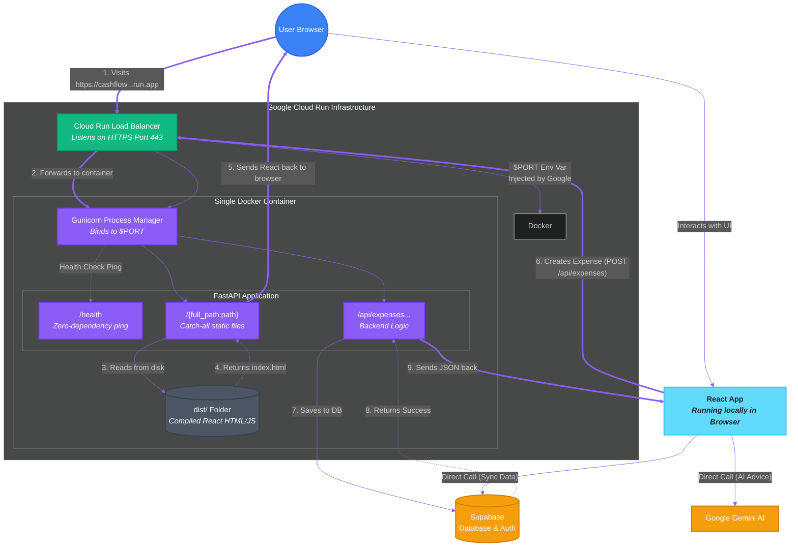

# Cashflow Application Architecture & Flow

This flowchart visually explains how your application works, both locally and when deployed to Google Cloud Run. It illustrates the dual-role of FastAPI: as a static file server and as an API backend.

## Architecture Flowchart

## How It Works (Step-by-Step)

### Phase 1: The Initial Load (FastAPI as a Delivery Boy)
1. **The Request**: You open your browser and go to your Cloud Run URL.
2. **The Cloud**: Google Cloud Run's Load Balancer intercepts that request and passes it into your single Docker container via Gunicorn.
3. **The Catch-All**: The request hits FastAPI. Since it's not searching for `/health` or `/api/`, it falls into the greedy catch-all router (`@app.get("/{full_path:path}")`).
4. **The Disk Read**: FastAPI looks into the `dist/` folder sitting inside the Docker container, finds `index.html`, and sends it all the way back to your browser.
5. **The Handoff**: Your browser downloads the Javascript and HTML. **The React application now lives locally on your computer.** 

### Phase 2: Using the App (FastAPI as a Smart Backend)
1. **The Action**: Inside the app (now running in your browser), you add an expense and click submit.
2. **The API Call**: The React javascript fires a background `fetch` request back across the internet to the specific endpoint: `/api/expenses/bulk`.
3. **The Logic**: Google Cloud Run routes this to FastAPI. The `/api/` router intercepts it, validates the data, checks your X-Personal-Token, and talks securely to Supabase.
4. **The Response**: FastAPI returns a JSON status code. Your React frontend reads the JSON and updates the UI on your screen.

*Note: For many other features (like the FIRE Calculator or fetching Gemini advice), React skips FastAPI entirely and just talks directly to those services over the internet using the browser!*
